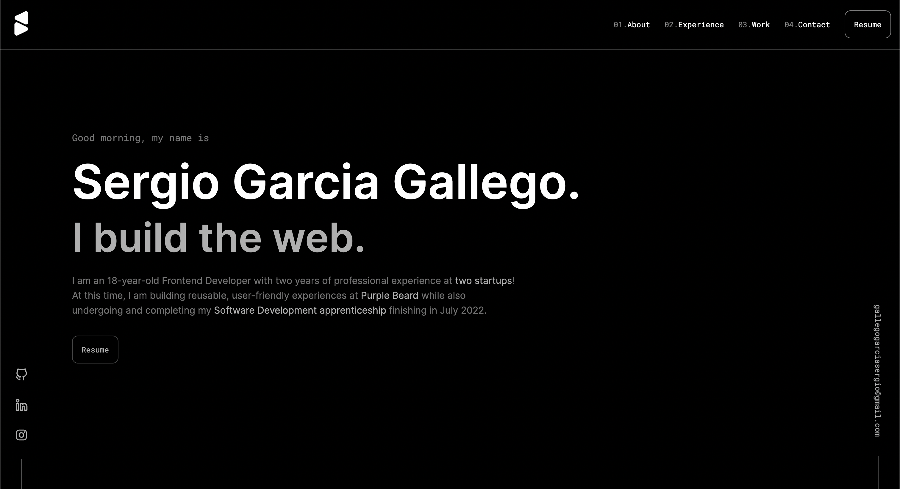

  

<h1 align="center">
  iamsergio.dev - v2
</h1>

  The second iteration of <a href="https://iamsergio.dev" target="_blank" rel="noreferrer">iamsergio.dev</a> built with <a href="https://www.gatsbyjs.org/" target="_blank">Gatsby</a> and hosted with <a href="https://www.vercel.com/" target="_blank">Vercel</a>

  Previous iteration:
  <a href="https://github.com/sgarciagallego/v1" target="_blank" rel="norefferer">v1</a>

